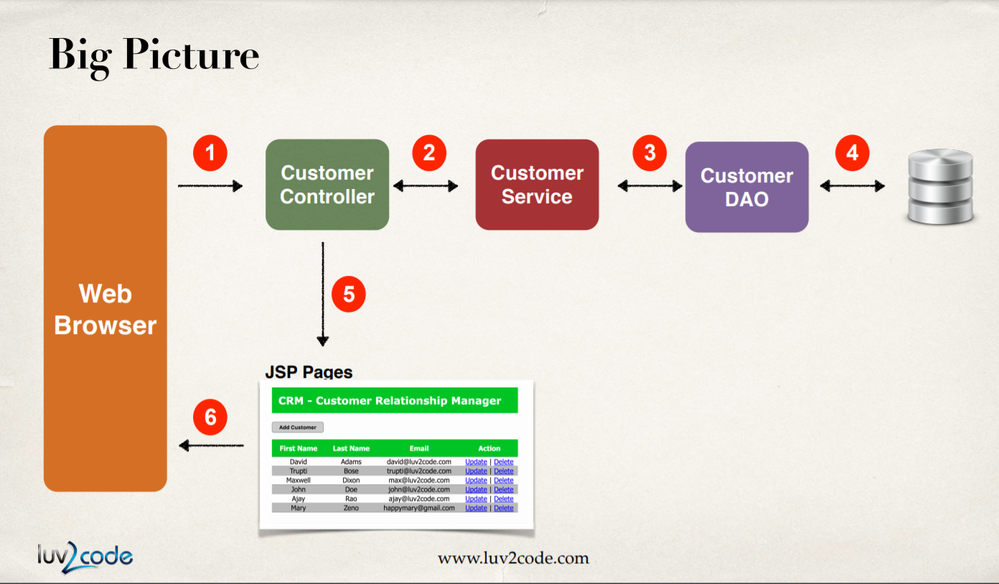
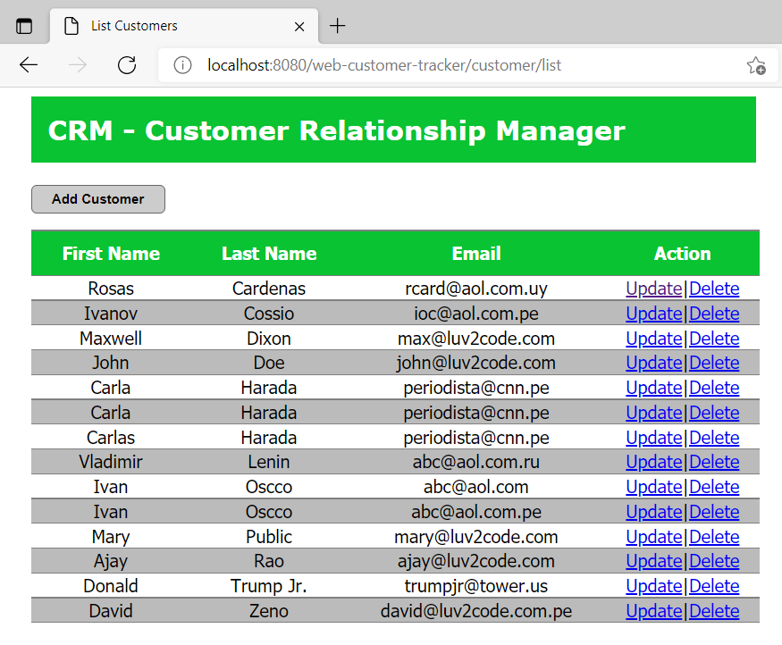

# SpringMVC_Hibernate

**Building a complete web project based on lectures of Chad Darby's course on Udemy: Spring and Hibernate**

The project considered build both a backend and frontend solution using as a database to MySQL. The objetive was to perform all CRUD operations throught a UI based on web.

**The big picture of the workflow is showed here**

 
  

**The final interface is showed here**

## Back-end technologies
- Java 1.8 (Zulu)
- Springframework 5.0.2
- Hibernate 5.2.0
- Tomcat 9

## Front-end technologies
- HTML/CSS/JS
- JSP/JSTL

## Database
- MySQL 8

## Tools
- Eclipse
- Gitbash 
- MySqlWorkbench

## Support
- Stackoverflow

